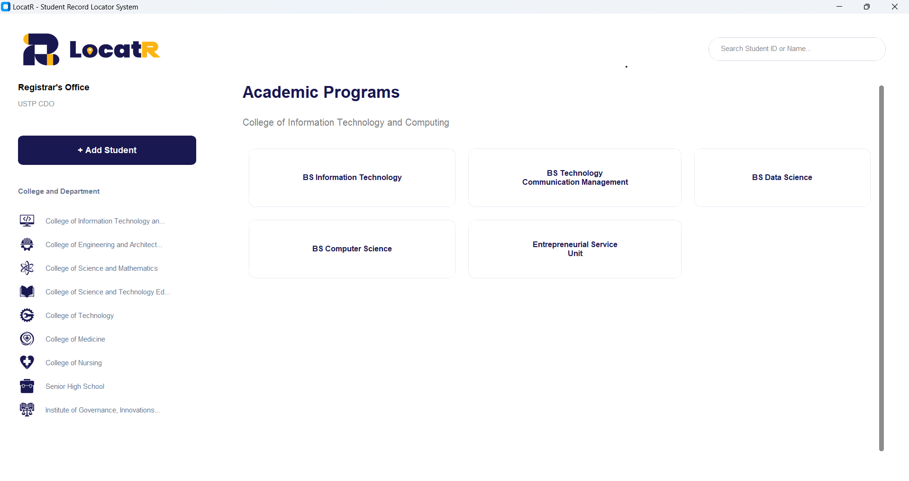

# LocatR - Student Record Locator System

**Requested by the Office of the University Registrar - USTP CDO**


---

## Features


- **Academic Dashboard:** A visual homepage displaying all Academic Units for quick navigation.
- **Add Students:** Input student ID, name, course, and location. The location can be set to `UP` or `DOWN` using radio buttons.
- **Edit Students:** Modify existing student details. Ensures unique student IDs.
- **Delete Students:** Remove student records with a confirmation prompt.
- **Generate QR Codes:** Automatically generate a QR code for any student record and save it as a PNG file.
- **Search Students:** Search by Student ID or Name dynamically.
- **Scrollable List:** View all students in a scrollable, organized table.
- **Input Validation:**
  - Student ID must be exactly 10 digits and unique.
- **SQLite Database:** Stores student information persistently.
- **Custom UI Design:** Uses Tkinter Designer-generated layout and custom images for buttons and entries.
- **DPI Awareness:** Automatically adjusts for high-DPI screens on Windows.

---

## Screenshots

  
  


---

## Installation

1. **Clone the repository:**

   ```bash
   git clone https://github.com/yourusername/StudentRecordLocatorSystem.git
   cd StudentRecordLocatorSystem

   ```

2. **Install Dependencies:**

   ```bash
    pip install pillow

   ```

3. **Run the Application:**
   ```bash
    python main.py
   ```

## Dependencies

- **Python 3.9+**
- **CustomTkinter** (Modern UI framework)
- **Pillow** (for image handling)
- **QRCode** (for generating student codes)
- **SQLite3** (comes with Python standard library)

## Notes

- This project was specifically requested by the Office of the University Registrar - USTP CDO to manage student record location data efficiently.
- All UI elements are dynamically rendered and support high-DPI displays on Windows.
- Ensure the assets/ folder remains in the same path relative to main.py to avoid missing images.

## Author

**Joseph T. Pendon Jr.**
University Student | Software Developer

**Wency G. Casiño**
University Student | Software Developer

**Kent John J. Chavo**
University Student | Software Developer
